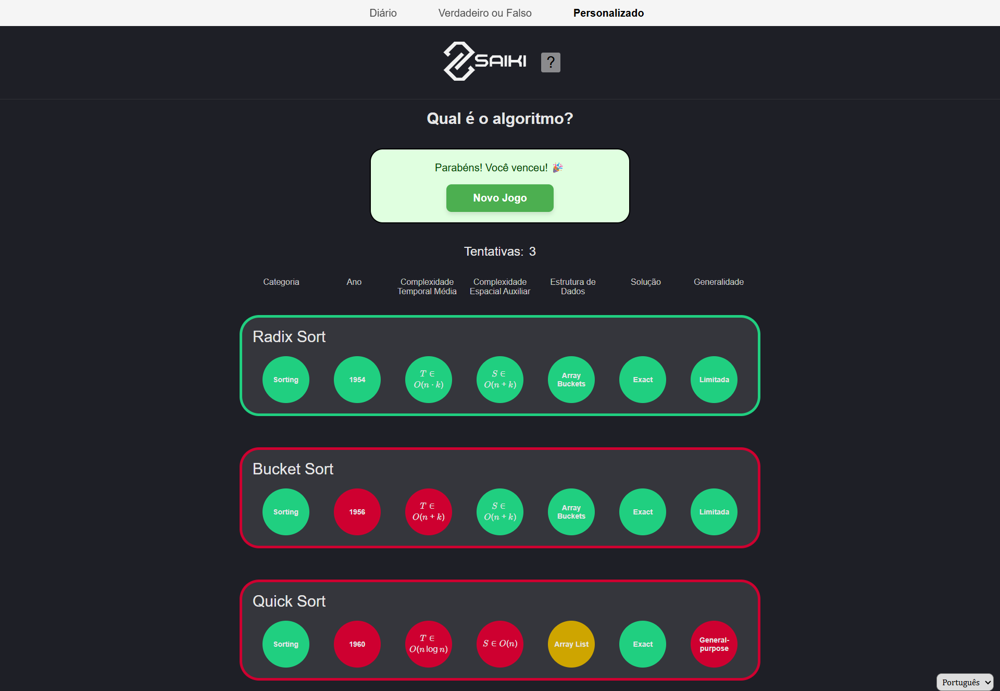

# Saiki-Project
Flashcard game project for the Software Engineering ll course, taught by Professor Aline Brito.

# Saiki - Educational Algorithm Guessing Game

**Saiki** is an interactive and educational web-based game designed to teach classic algorithms in a fun and visual way.

Users can play a normal session, or can be challenged to guess the "algorithm of the day" by analyzing technical clues related to well-known algorithms in sorting and graph search, such as **Bubble Sort**, **Merge Sort**, **Quick Sort**,  **Dijkstra**, **A\***, **BFS**, **DFS**, and more.

Each guess is evaluated by comparing the algorithm’s technical attributes, and the interface highlights each field with a colored indicator:
- **Green**: correct
- **Red**: incorrect
- **Yellow**: partially correct

The goal is to reinforce CS students understanding of algorithmic concepts through pattern recognition and repeated exposure.
It's like Wordle, but focused on CS.
---

## Screenshot

Below is an example of the game in action:



In this example, the player made three attempts:
- First attempt: `Bubble Sort` → incorrect - several red (incorrect) fields and a yellow (partially correct) field
- Second attempt: `Merge Sort` → incorrect - some red fields
- Tird attempt: `Radix Sort` → correct - all fields green

---

## Features

- Interactive guessing game based on classic computer science algorithms
- Covers a wide range of algorithms in:
  - Sorting (e.g., Merge Sort, Insertion Sort)
  - Graph search (e.g., Dijkstra, A*, BFS, DFS, Bellman-Ford, Floyd-Warshall)
- Visual feedback for each technical field in the answer
- Educational fields used to describe each algorithm:
  - Category
  - Year
  - Average Time Complexity
  - Auxiliary Space Complexity
  - Data Structure
  - Solution Type
  - Generality
- Designed for learning through engagement and repetition

---

## Technologies Used

- **Frontend**: HTML5, JavaScript
- **Midend**: Python (Django)
- **Backend**: Python (Django)

---

## How to Run the Project

### Requirements:
- Pyhton 3.12 or above
- Python's pip package manager.
- A web browser of your choice
- Optionally `Make` for ease of installation and lauching of the project.

### Run Locally:
1. **Clone the repository**
  ```bash
  git clone https://github.com/AndreiCristeli/saiki.git
  cd saiki
  ```

2. **Run the MakeFile script**

  Simply running:

  ```
  make install
  make django-migrate
  make run-django
  ```
  Should work in both Windows and Linux-based systems.

  This should start a local server in your localhost.

3. **Connect to `localhost:8000`\* in your prefered browser**

*The site must be accessed from `localhost:8000` instead of `127.0.0.1:8000` to work properly. 

## Releases Notes

### V 0.0.1
### Sistema
* Cookies:
 O frontend salva cookies na maquina para salvar o estado atual do jogador, e posteriormente os envia para o backend, que por sua vez ainda não os utiliza de forma efetiva.
* Comunicação entre frontend e servidor:
Realizada através de requisições entre scripts em javascript (frontend) e python (backend). Essa comunicação possibilita que o banco de dados alimente o servidor.
* Servidor com Banco de Dados DJango:
 O middleware Django funciona como um midend para fornecer as informações necessárias para o frontend, sendo o Django tanto o servidor da aplicação como o midend.
 
### Usabilidade:
* Jogo de advinhação simples:
Atualmente, o jogo de advinhação está disponível para os algoritmos de ordenação.
