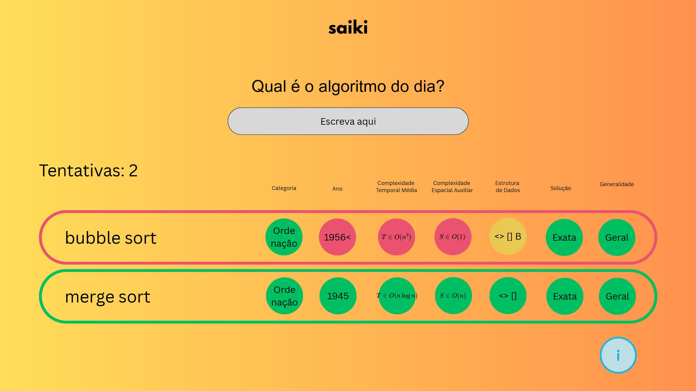

# Saiki-Project
Flashcard game project for the Software Engineering ll course, taught by Professor Aline Brito.

# Saiki - Educational Algorithm Guessing Game

**Saiki** is an interactive and educational web-based game designed to teach classic algorithms in a fun and visual way.

Users can play a normal session, or can be challenged to guess the "algorithm of the day" by analyzing technical clues related to well-known algorithms in sorting and graph search, such as **Bubble Sort**, **Merge Sort**, **Quick Sort**,  **Dijkstra**, **A\***, **BFS**, **DFS**, and more.

Each guess is evaluated by comparing the algorithm’s technical attributes, and the interface highlights each field with a colored indicator:
- **Green**: correct
- **Red**: incorrect
- **Yellow**: partially correct

The goal is to reinforce CS students understanding of algorithmic concepts through pattern recognition and repeated exposure.
It's like Wordle, but focused on CS.
---

## Screenshot

Below is an example of the game in action:



In this example, the player made two attempts:
- First attempt: `bubble sort` → incorrect (several red or yellow fields)
- Second attempt: `merge sort` → correct (all fields green)

---

## Features

- Interactive guessing game based on classic computer science algorithms
- Covers a wide range of algorithms in:
  - Sorting (e.g., Merge Sort, Insertion Sort)
  - Graph search (e.g., Dijkstra, A*, BFS, DFS, Bellman-Ford, Floyd-Warshall)
- Visual feedback for each technical field in the answer
- Educational fields used to describe each algorithm:
  - Category
  - Year
  - Average Time Complexity
  - Auxiliary Space Complexity
  - Data Structure
  - Solution Type
  - Generality
- Designed for learning through engagement and repetition

---

## Technologies Used

- **Frontend**: HTML5, JavaScript (...)
- **Midend**: Python (Django) (...)
- **Backend**: Python (Django) (...)
- **Game Logic**: Client-side validation and comparison with algorithm data (...)
- **Data Format**: Algorithms defined in structured JSON format (...)

---

## How to Run the Project

1. **Clone the repository**
   ```bash
   git clone https://github.com/AndreiCristeli/saiki.git
   cd saiki
   (...)


## Releases Notes

### V 0.0.1
### Sistema
** Cookies:
* O frontend salva cookies na maquina e envia para o backend, porém não os utiliza.
** Comunicação entre frontend e servidor:
* Realizada através de requisições entre scripts em javascript (frontend) e python (backend). Essa comunicação possibilita que o banco de dados alimente o servidor.
** Servidor com Banco de Dados DJango:
* O servidor funciona como um midend para fornecer as informações necessárias para o frontend.
 
### Usabilidade:
** Jogo de advinhação simples:
* O jogo de advinhação está disponível para os algoritmos de ordenação.
