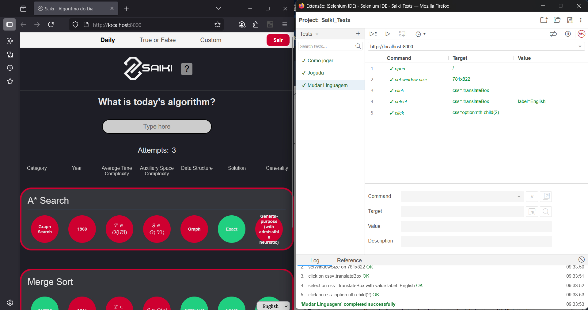

# Testes Implementados

Foram realizados os seguintes testes de interface utilizando a ferramenta Selenium:

- Teste 1: Opção "como jogar"

Descrição do teste: ao carregar a página, clickar no botão "como jogar" e fechá-lo logo em seguida.

- Teste 2: Alterar idioma

Descrição do teste: ao carregar a página, clickar na caixa de línguas no canto inferior direito, selecionar dentre as opções aquela que possui rótulo "English" e clickar.

- Teste 3: Simulação de tentativas

Descrição do teste: ao carregar a página, clickar na caixa de texto, digitar "Bubble" e clickar no primeiro item sugerido. Depois, clickar na caixa de texto, digitar
"m" e clickar no primeiro item sugerido. Por fim, clickar na caixa de texto, digitar "a" e clickar no primeiro item sugerido.
